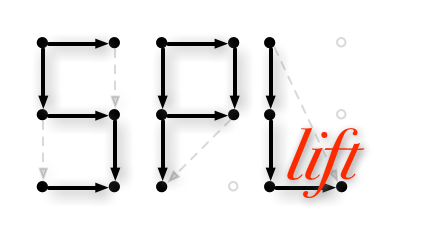
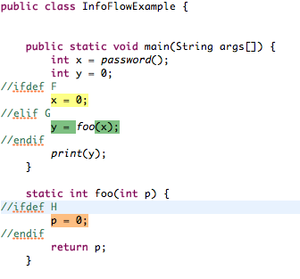
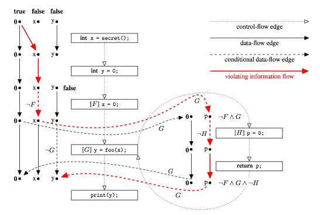

SPLlift
=====================
SPLlift is an approach that lets you automatically reuse inter-procedural static data-flow analyses implemented in the IFDS framework also for entire Software Product Lines (SPLs). If, for normal programs, the analysis reports that a piece of analysis information may or may not hold at a given statement, the SPL-version reports a Boolean constraint telling you under which feature combinations this fact could hold at that statement. This all can be done without having to change a single line of code on the side of the client analysis.

For example, assume a taint analysis that reports cases in which the return value of `password()` flows into `print(..)`. For the following product line, SPLlift would report that such a case can occur if and only if `F` and `H` are disabled and `G` is enabled:

Who are the developers of SPLlift?
----------------------------------
SPLlift is a joint development of Eric Bodden Claus Brabrand, Tarsis Toledo, Marcio Ribeiro, Paulo Borba and Mira Mezini. It is currently maintained by [Eric Bodden][5].

Why is SPLlift called SPLlift?
------------------------------
It is called SPLlift because it allows existing analyses that are designed for "normal Java programs" to be lifted to analyses that operate on entire software product lines.

Are there any publications on SPLlift?
--------------------------------------
Yes, there are:

[SPLlift – Statically Analyzing Software Product Lines in Minutes Instead of Years][9] (Eric Bodden, Mira Mezini, Claus Brabrand, Társis Tolêdo, Márcio Ribeiro, Paulo Borba), In ACM SIGPLAN Conference on Programming Language Design and Implementation (PLDI 2013), 2013.

[Transparent and Efficient Reuse of IFDS-based Static Program Analyses for Software Product Lines][4] (Eric Bodden, Társis Tolêdo, Márcio Ribeiro, Claus Brabrand, Paulo Borba, Mira Mezini), Technical report TUD-CS-2012-0239, EC SPRIDE, Technische Universität Darmstadt, 2012.

What is IFDS/IDE?
-----------------
[IFDS][1] is a general framework for solving inter-procedural, finite, distributive subset problems in a flow-sensitive, fully context-sensitive manner. From a user's perspective, IFDS allows static program analysis in a template-driven manner. Users simply define flow functions for an analysis problem but don't need to worry about solving the analysis problem. The latter is automatically taken care of by the solver, in this case by [Heros][3].
[IDE][2] is an extension of IFDS that allows more expressive computations. Heros implements an IDE solver and supports IFDS problems as special cases of IDE. SPLlift replaces this "adapter" by a more expressive one that automatically tracks feature constraints as shown in this figure:

How can I contribute to SPLlift?
--------------------------------
Contributions are more than welcome! It is easiest to fork the project on Github. Then make your modifications on the fork and send us a pull request. This will allow us easy re-integration.

[1]: http://dx.doi.org/10.1145/199448.199462
[2]: http://dx.doi.org/10.1016/0304-3975(96)00072-2
[3]: https://github.com/Sable/heros/
[4]: http://www.bodden.de/pubs/btr+12transparent.pdf
[5]: http://www.bodden.de/
Why is SPLlift called SPLlift?
------------------------------
It is called SPLlift because it allows existing analyses that are designed for "normal Java programs" to be lifted to analyses that operate on entire software product lines.

Which dependencies does SPLlift have?
-------------------------------------
SPLlift is based on [Heros][3], [Soot][6], [CIDE][7] and [JavaBDD][8]. Thanks to the developers of those tools for making them available!

How do I build and run SPLlift?
-------------------------------
Issue the following commands to clone the repositories of SPLlift and its dependencies:
<pre>
git clone https://github.com/Sable/heros.git
git clone https://github.com/Sable/soot.git
git clone https://github.com/Sable/jasmin.git
git clone https://github.com/secure-software-engineering/SPLlift.git
</pre>
This should give you four folders (i.e., four local git repositories) with "develop" branches checked out for each repository.

Second, install [CIDE][7] in your Eclipse IDE by using the following update site:
<pre>
http://wwwiti.cs.uni-magdeburg.de/iti_db/research/cide/update/
</pre>

Open eclipse and (we use version 3.7.1) import all projects from the above four folders into your workspace. The projects should build right out of the box. You can test SPLlift through an eclipse run configuration.

Do you have questions? Please let us know!

How can I contribute to SPLlift?
--------------------------------
Contributions are more than welcome! It is easiest to fork the project on Github. Then make your modifications on the fork and send us a pull request. This will allow us easy re-integration.

[1]: http://dx.doi.org/10.1145/199448.199462
[2]: http://dx.doi.org/10.1016/0304-3975(96)00072-2
[3]: https://github.com/Sable/heros/
[4]: http://www.bodden.de/pubs/btr+12transparent.pdf
[5]: http://www.bodden.de/
[6]: https://github.com/Sable/soot
[7]: http://wwwiti.cs.uni-magdeburg.de/iti_db/research/cide/
[8]: http://javabdd.sourceforge.net/
[9]: http://www.bodden.de/pubs/bmb+13spllift.pdf
